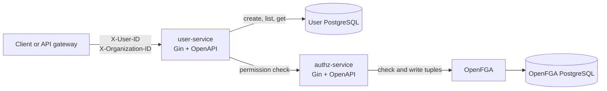

# Go Learner Kit

A small Go microservice workspace for learning API design, tenant isolation, and relationship-based authorization. It contains a user API backed by PostgreSQL and a private authorization service backed by OpenFGA.

## Architecture



`user-service` is the only service exposed on the host. `authz-service`, OpenFGA, and both databases stay on the Compose network.

User records belong to an organization. Every user route requires trusted identity headers injected by a gateway or another trusted caller:

```http
X-User-ID: <user UUID>
X-Organization-ID: <organization UUID>
```

OpenFGA stores role assignments as organization relationships. In the initial model, an organization `admin` can `list_users` and `create_user`; retrieving a user requires `list_users` and is restricted to the requested organization.

## Services

| Service | Responsibility |
| --- | --- |
| `user-svc` | Creates, lists, and retrieves organization-scoped users. It fails closed if authorization is denied or unavailable. |
| `authz-svc` | Initializes the OpenFGA model, seeds an initial admin, checks permissions, and provides private admin role assignment endpoints. |
| OpenFGA | Evaluates organization relationship tuples. |

## Run locally

Prerequisites: Docker and Docker Compose.

```bash
cp .env.example .env
docker compose up --build
```

The API is available at `http://localhost:8080`. The default bootstrap values in `.env.example` identify the first organization and its administrator. Replace them with UUIDs appropriate for your environment before sharing a deployment.

The stack runs OpenFGA's one-shot schema migration before starting OpenFGA. If you started a previous version of the stack and saw `relation "store" does not exist`, apply this update and restart the stack; the `openfga-migrate` service creates the missing tables.

Create a user with the seeded administrator:

```bash
curl -X POST http://localhost:8080/users \
  -H 'Content-Type: application/json' \
  -H 'X-User-ID: 11111111-1111-1111-1111-111111111111' \
  -H 'X-Organization-ID: 22222222-2222-2222-2222-222222222222' \
  -d '{"name":"Ada Lovelace","email":"ada@example.com"}'
```

## Development notes

The user migration that adds organization ownership assumes a disposable development database. Reset Compose volumes before applying it to a database created by an earlier version:

```bash
docker compose down -v
docker compose up --build
```

Run service tests independently:

```bash
(cd user-svc && go test ./...)
(cd authz-svc && go test ./...)
```

See [user-svc/README.md](user-svc/README.md) and [authz-svc/README.md](authz-svc/README.md) for service-specific details.

## Load testing

The [k6/user-service.js](k6/user-service.js) scenario verifies the ready probe, then repeatedly creates, retrieves, and lists users with the configured organization administrator. It generates a unique email for every iteration.

After starting the Compose stack, run:

```bash
k6 run k6/user-service.js
```

Override the target and load profile as needed:

```bash
BASE_URL=http://localhost:8080 \
USER_ID=11111111-1111-1111-1111-111111111111 \
ORGANIZATION_ID=22222222-2222-2222-2222-222222222222 \
VUS=25 HOLD=2m k6 run k6/user-service.js
```

The default thresholds require fewer than 1% failed HTTP requests, 95th-percentile request latency below 500 ms, and more than 99% successful checks. k6 exposes these configuration values through `__ENV` and exits non-zero when a threshold fails. [k6 environment variables](https://grafana.com/docs/k6/latest/using-k6/environment-variables/), [k6 thresholds](https://grafana.com/docs/k6/latest/using-k6/thresholds/)

The root `Makefile` manages the whole stack and runs k6 from Docker. After `make up`, send exactly one authenticated `GET /users` request with:

```bash
make k6-once
```
